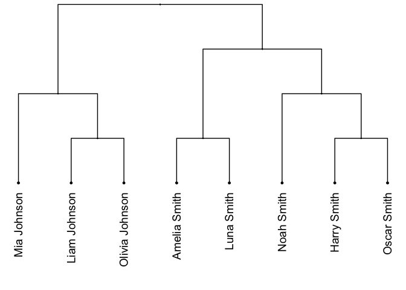
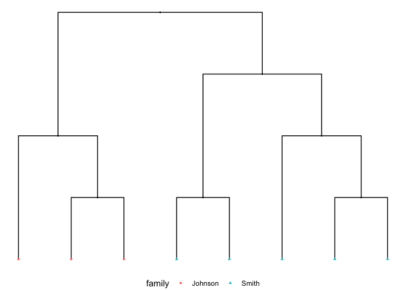
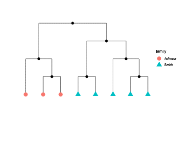

<!-- README.md is generated from README.Rmd. Please edit that file -->

# TidyJaccard

<!-- badges: start -->

[](https://lifecycle.r-lib.org/articles/stages.html#experimental)
[](https://github.com/selkamand/tidyjaccard/actions/workflows/R-CMD-check.yaml)
[](https://CRAN.R-project.org/package=tidyjaccard)
[](https://app.codecov.io/gh/selkamand/tidyjaccard?branch=master)
<!-- badges: end -->

Effortless all vs all Jaccard similarity from tidy dataframes.

## Philosophy

For TidyJaccard to work seamlessly, ensure that your dataframe includes
two columns:

1.  **sample_identifier**: This column should contain unique identifiers
    for each sample in your dataset.

2.  **set**: Each row in this column defines an element within the set
    corresponding to the respective sample identifier. This column plays
    a pivotal role in calculating Jaccard similarity.

Names of columns doesn’t matter.

## Installation

You can install the development version of tidyjaccard like so:

``` r
remotes::install_github('selkamand/tidyjaccard')
```

## Getting Started

Here’s an example
[dataset](https://github.com/selkamand/tidyjaccard/blob/master/inst/smith_and_johnson.csv)
describing physical traits of two families

- Family 1: Smith (5 members)

- Family 2: Johnson (3 members)

*Research Question:* Which people in the dataset are most physically
similar to one another? Do they tend to come from the same family?

For each member of the family, we’ve recorded physical traits. Each row
in our dataset describes one trait present in one individual.

Lets look at the data:

``` r
library(tidyjaccard)

# Inbuilt Dataset Describing Smith and Johnson family members
head(family)
#>          name          trait
#> 1 Harry Smith           tall
#> 2 Harry Smith     brown hair
#> 3 Harry Smith      pink eyes
#> 4 Harry Smith       freckles
#> 5 Harry Smith double jointed
#> 6 Harry Smith   pointed ears
```

### Compute Jaccard Similarity

``` r
# Compute similarity
family |>
  tidy_pairwise_jaccard_similarity(col_sample = "name", col_trait = "trait") # Compute Jaccard Similarity
#>           name1          name2    jaccard set_size
#> 1   Harry Smith     Luna Smith 0.15384615       13
#> 2   Harry Smith    Oscar Smith 0.23076923       13
#> 3   Harry Smith   Amelia Smith 0.13333333       15
#> 4   Harry Smith     Noah Smith 0.18181818       11
#> 5   Harry Smith    Mia Johnson 0.00000000       13
#> 6   Harry Smith   Liam Johnson 0.07142857       14
#> 7   Harry Smith Olivia Johnson 0.16666667       12
#> 8    Luna Smith    Oscar Smith 0.07142857       14
#> 9    Luna Smith   Amelia Smith 0.45454545       11
#> 10   Luna Smith     Noah Smith 0.20000000       10
#> 11   Luna Smith    Mia Johnson 0.09090909       11
#> 12   Luna Smith   Liam Johnson 0.00000000       14
#> 13   Luna Smith Olivia Johnson 0.08333333       12
#> 14  Oscar Smith   Amelia Smith 0.13333333       15
#> 15  Oscar Smith     Noah Smith 0.18181818       11
#> 16  Oscar Smith    Mia Johnson 0.00000000       13
#> 17  Oscar Smith   Liam Johnson 0.00000000       15
#> 18  Oscar Smith Olivia Johnson 0.00000000       14
#> 19 Amelia Smith     Noah Smith 0.16666667       12
#> 20 Amelia Smith    Mia Johnson 0.07692308       13
#> 21 Amelia Smith   Liam Johnson 0.14285714       14
#> 22 Amelia Smith Olivia Johnson 0.15384615       13
#> 23   Noah Smith    Mia Johnson 0.11111111        9
#> 24   Noah Smith   Liam Johnson 0.09090909       11
#> 25   Noah Smith Olivia Johnson 0.22222222        9
#> 26  Mia Johnson   Liam Johnson 0.33333333        9
#> 27  Mia Johnson Olivia Johnson 0.37500000        8
#> 28 Liam Johnson Olivia Johnson 0.62500000        8
```

### Convert to distance matrix

We can convert the tidy similarity to a distance matrix for use with
many functions

``` r
family |>
  tidy_pairwise_jaccard_similarity(col_sample = "name", col_trait = "trait") |> # Compute Jaccard Similarity
  tidy_toggle_simdist() |> # Convert similarity to distance
  tidy_to_matrix() |> # Convert to matrix
  matrix_to_dist_class() # Convert matrix to 'dist' class (for compatibility with hclust)
#>                Amelia Smith Harry Smith Liam Johnson Luna Smith Mia Johnson
#> Harry Smith       0.8666667                                                
#> Liam Johnson      0.8571429   0.9285714                                    
#> Luna Smith        0.5454545   0.8461538    1.0000000                       
#> Mia Johnson       0.9230769   1.0000000    0.6666667  0.9090909            
#> Noah Smith        0.8333333   0.8181818    0.9090909  0.8000000   0.8888889
#> Olivia Johnson    0.8461538   0.8333333    0.3750000  0.9166667   0.6250000
#> Oscar Smith       0.8666667   0.7692308    1.0000000  0.9285714   1.0000000
#>                Noah Smith Olivia Johnson
#> Harry Smith                             
#> Liam Johnson                            
#> Luna Smith                              
#> Mia Johnson                             
#> Noah Smith                              
#> Olivia Johnson  0.7777778               
#> Oscar Smith     0.8181818      1.0000000
```

### Heirarchical Clustering and Visualisation

Heirarchical clustering is as simple as running `hclust()` on the
distance matrix. Then just pipe to `visualise_dendogram_ggraph()` to
visualise the relationships

``` r
family |>
  tidy_pairwise_jaccard_similarity(col_sample = "name", col_trait = "trait") |> # Compute Jaccard Similarity
  tidy_toggle_simdist() |> # Convert similarity to distance
  tidy_to_matrix() |> # Convert to matrix
  matrix_to_dist_class() |> # Convert matrix to 'dist' class (for compatibility with hclust)
  hclust(method = "complete") |> # Do heirarchical clustering
  visualise_dendrogram_ggraph(draw_labels = TRUE) # Visualise the dendrogram
```



### Customising Visualisation

Finally lets map some metadata about each family member to different
visual properties.

Requirements: a dataframe with 1 row per leaf node. The first column
will be our describe the label of each leaf node (e.g. Mia Johnson, Liam
Johnson etc). This dataframe should also include columns we can map to
colour, shape, and tooltips / data_ids for when we make the plot
interactive.

``` r
print(family_member_annotations)
#>             name  family
#> 1    Harry Smith   Smith
#> 2     Luna Smith   Smith
#> 3    Oscar Smith   Smith
#> 4   Amelia Smith   Smith
#> 5     Noah Smith   Smith
#> 6    Mia Johnson Johnson
#> 7   Liam Johnson Johnson
#> 8 Olivia Johnson Johnson
#>                                                                                             traits
#> 1         tall,brown hair,pink eyes,freckles,double jointed,pointed ears,large elbows,right handed
#> 2                        black hair,pink eyes,freckles,dimples,glossy hair,left handed,green thumb
#> 3       short,brown hair,grey eyes,quirky ears,left handed,double jointed,widows peak,pointed ears
#> 4 blonde hair,pink eyes,dimples,freckles,bushy brows,glossy hair,widows peak,pink hair,left handed
#> 5                                     brown hair,left handed,purple eyes,freckles,mid-digital hair
#> 6                                black hair,purple eyes,attached earlobes,ambidextrous,bushy brows
#> 7      blonde hair,purple eyes,attached earlobes,bushy brows,right handed,moustache,long eyelashes
#> 8                   purple eyes,freckles,attached earlobes,long eyelashes,right handed,bushy brows
#>                                                                                                                                           tooltip
#> 1          Name: Harry Smith<br>Family: Smith<br>Traits: tall,brown hair,pink eyes,freckles,double jointed,pointed ears,large elbows,right handed
#> 2                          Name: Luna Smith<br>Family: Smith<br>Traits: black hair,pink eyes,freckles,dimples,glossy hair,left handed,green thumb
#> 3        Name: Oscar Smith<br>Family: Smith<br>Traits: short,brown hair,grey eyes,quirky ears,left handed,double jointed,widows peak,pointed ears
#> 4 Name: Amelia Smith<br>Family: Smith<br>Traits: blonde hair,pink eyes,dimples,freckles,bushy brows,glossy hair,widows peak,pink hair,left handed
#> 5                                       Name: Noah Smith<br>Family: Smith<br>Traits: brown hair,left handed,purple eyes,freckles,mid-digital hair
#> 6                               Name: Mia Johnson<br>Family: Johnson<br>Traits: black hair,purple eyes,attached earlobes,ambidextrous,bushy brows
#> 7    Name: Liam Johnson<br>Family: Johnson<br>Traits: blonde hair,purple eyes,attached earlobes,bushy brows,right handed,moustache,long eyelashes
#> 8               Name: Olivia Johnson<br>Family: Johnson<br>Traits: purple eyes,freckles,attached earlobes,long eyelashes,right handed,bushy brows
```

``` r
gg_dendogram <- family |>
  tidy_pairwise_jaccard_similarity(col_sample = "name", col_trait = "trait") |> # Compute Jaccard Similarity
  tidy_toggle_simdist() |> # Convert similarity to distance
  tidy_to_matrix() |> # Convert to matrix
  matrix_to_dist_class() |> # Convert matrix to 'dist' class (for compatibility with hclust)
  hclust(method = "complete") |> # Do heirarchical clustering
  visualise_dendrogram_ggraph( # Visualise the dendrogram
    annotations = family_member_annotations, # Dataframe with 1 row per labelled node
    col_label = name, 
    col_colour = family, 
    col_shape = family,
    col_tooltip = tooltip,
    col_data_id = family
    ) 

gg_dendogram
```



### Adding Interactivity

Make the dendrogram interactive using `visualisation_make_interactive()`

``` r
visualisation_make_interactive(gg_dendogram)
```



## Examples of Other Applications

RNAseq data

- col_sample = sample identifier
- col_trait = overexpressed genes

Microbiome data

- col_sample = sample identifier
- col_trait = microbes present
